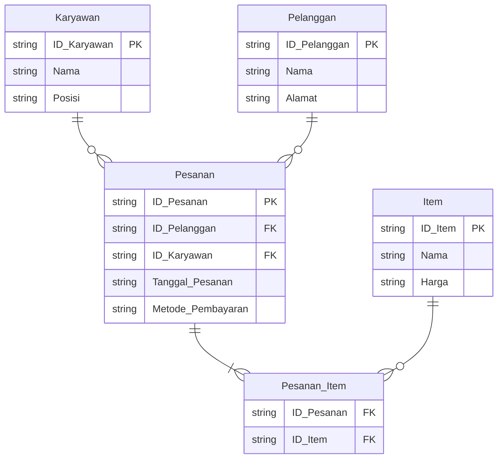

# Database Normalization
Praktikum Sistem Basis Data Modul 2

## Data Diri

Nama : Ardhi Putra Pradana

NRP : 5027241022

Kelas : C

Asisten: NOPS

## Tahap Normalisasi

> - [+] : Tabel yang ditambahkan atau tabel baru
> - [*] : Tabel yang sudah ada dan diubah

### Bentuk awal

| ID_Pesanan | Nama_Pelanggan | Alamat_Pelanggan      | Tanggal_Pesanan | Item_Dipesan      | Harga_Item    | Nama_Karyawan | Posisi_Karyawan | Metode_Pembayaran |
| ---------- | -------------- | --------------------- | --------------- | ----------------- | ------------- | ------------- | --------------- | ----------------- |
| 1          | Agus Sustisna  | Jl. Medokan semampir  | 2023-09-21      | Burger, Aquase    | 15.000, 2.500 | Tuna          | Kasir           | Tunai             |
| 2          | Udin Pangalila | Sukolilo Park Regency | 2023-10-02      | Salad, Kopi Tarik | 15.000, 5.000 | Alice         | Pelayan         | Kartu Kredit      |
| 3          | Selamet        | Kejawan Gebang No. 15 | 2023-10-03      | Pizza, Teh Anget  | 20.000, 3.000 | Tuna          | Kasir           | Tunai             |
| 4          | Wahyu Purnama  | Keputih Tegal Timur   | 2023-10-12      | Steak, Kopi Tarik | 30.000, 5.000 | Samsul        | Koki            | QRIS              |
| 5          | Suci Aprillia  | Jl. Gebang Putih      | 2023-10-13      | Pasta, Aquase     | 17.000, 2.500 | Alice         | Pelayan         | Kartu Debit       |

### Normalisasi 1NF

Jika dilihat pada bentuk awal tabel terdepat duplikasi atribut data yaitu pada atribut `Item_Dipesan` dan `Harga_Item`.
Karena syarat pada **Normalisasi 1NF** tidak diperkenankan adanya duplikasi atribut, maka harus dilakukan perubahan menjadi sebagai berikut ini.
Dan juga dengan sedkit merubah bentuk dari value `ID_Pesanan` agar lebih komprehensif.

#### [*] Tabel `Pesanan`

| ID_Pesanan | Nama_Pelanggan | Alamat_Pelanggan      | Tanggal_Pesanan | Item_Dipesan | Harga_Item | Nama_Karyawan | Posisi_Karyawan | Metode_Pembayaran |
| ---------- | -------------- | --------------------- | --------------- | ------------ | ---------- | ------------- | --------------- | ----------------- |
| P001       | Agus Sustisna  | Jl. Medokan semampir  | 2023-09-21      | Burger       | 15.000     | Tuna          | Kasir           | Tunai             |
| P002       | Agus Sustisna  | Jl. Medokan semampir  | 2023-09-21      | Aquase       | 2.500      | Tuna          | Kasir           | Tunai             |
| P003       | Udin Pangalila | Sukolilo Park Regency | 2023-10-02      | Salad        | 15.000     | Alice         | Pelayan         | Kartu Kredit      |
| P004       | Udin Pangalila | Sukolilo Park Regency | 2023-10-02      | Kopi Tarik   | 5.000      | Alice         | Pelayan         | Kartu Kredit      |
| P005       | Selamet        | Kejawan Gebang No. 15 | 2023-10-03      | Pizza        | 20.000     | Tuna          | Kasir           | Tunai             |
| P006       | Selamet        | Kejawan Gebang No. 15 | 2023-10-03      | Teh Anget    | 3.000      | Tuna          | Kasir           | Tunai             |
| P007       | Wahyu Purnama  | Keputih Tegal Timur   | 2023-10-12      | Steak        | 30.000     | Samsul        | Koki            | QRIS              |
| P008       | Wahyu Purnama  | Keputih Tegal Timur   | 2023-10-12      | Kopi Tarik   | 5.000      | Samsul        | Koki            | QRIS              |
| P009       | Suci Aprillia  | Jl. Gebang Putih      | 2023-10-13      | Pasta        | 17.000     | Alice         | Pelayan         | Kartu Debit       |
| P010       | Suci Aprillia  | Jl. Gebang Putih      | 2023-10-13      | Aquase       | 2.500      | Alice         | Pelayan         | Kartu Debit       |

Sekarang tabel tersebut telah memenuhi syarat untuk **Normalisasi 1NF**

<div style="page-break-after: always;"></div>

### Normalisasi 2NF

Untuk melakukan **Normalisasi 2NF** harus menghilangkan *ketergantungan persial* yang ada pada tabel tersebut.
Jika dilihat dari hasil pada **Normalisasi 2NF** masih ada *ketergantungan parsial* disana, seperti disini banyak sekali ketergantungan mengenai item yang dibeli, dimana seharusnya item yang dibeli itu bergantung penuh dengan pelanggan yang membeli (`Nama_Pelanggan`) dan tidak bergantung penuh dengan `ID_Pesanan` dalam tabel tersebut.
Sehingga disini perlu untuk melakukan pemisahan dan membuat relasi untuk menghubungkan pesanan dengan item yang dibeli.

#### [*] Tabel `Pesanan`

| ID_Pesanan | Nama_Pelanggan | Alamat_Pelanggan      | Tanggal_Pesanan | Nama_Karyawan | Posisi_Karyawan | Metode_Pembayaran |
| ---------- | -------------- | --------------------- | --------------- | ------------- | --------------- | ----------------- |
| P001       | Agus Sustisna  | Jl. Medokan semampir  | 2023-09-21      | Tuna          | Kasir           | Tunai             |
| P002       | Udin Pangalila | Sukolilo Park Regency | 2023-10-02      | Alice         | Pelayan         | Kartu Kredit      |
| P003       | Selamet        | Kejawan Gebang No. 15 | 2023-10-03      | Tuna          | Kasir           | Tunai             |
| P004       | Wahyu Purnama  | Keputih Tegal Timur   | 2023-10-12      | Samsul        | Koki            | QRIS              |
| P005       | Suci Aprillia  | Jl. Gebang Putih      | 2023-10-13      | Alice         | Pelayan         | Kartu Debit       |

#### [+] Tabel `Item`

| ID_Item | Nama       | Harga   |
| ------- | ---------- | ------- |
| I001    | Burger     | 15.000  |
| I002    | Aquase     | 2.500   |
| I003    | Salad      | 15.0000 |
| I004    | Kopi Tarik | 3.000   |
| I005    | Pizza      | 20.000  |
| I006    | Teh Anget  | 3.000   |
| I007    | Steak      | 30.000  |
| I008    | Pasta      | 17.000  |

#### [+] Tabel `Pesanan_Item`

| ID_Pesanan | ID_Item |
| ---------- | ------- |
| P001       | I001    |
| P001       | I002    |
| P002       | I003    |
| P002       | I004    |
| P003       | I005    |
| P003       | I006    |
| P004       | I007    |
| P004       | I004    |
| P005       | I008    |
| P005       | I002    |

Dengan melakukan perubah struktural tabel menjadi seperti diatas maka proses **Normalisasi 2NF** telah berhasil terpenuhi, yaitu dengan menghilangkan *ketergantungan parsial*.

<div style="page-break-after: always;"></div>


### Normalisasi 3NF

Proses **Normalisasi 3NF** dilakukan untuk menghilangkan *ketergantungan transitif*.
```
A -> B
B -> C
```

Pada proses normalisasi sebelumnya masih terdapat *ketergantungan transitif*.
Dimana contohnya `Alamat_Pelanggan` memiliki ketergantungan dengan `Nama_Pelanggan`, dimana `Nama_Pelanggan` ini juga sebenarnya memiliki ketergantungan dengan `ID_Pesanan`.
Sama halnya dengan `Posisi_Karyawan` memiliki ketergantungan dengan `Nama_Karyawan`, dimana `Nama_Karyawan` ini juga sebanarnya memiliki ketergantungan dengan `ID_Pesanan`.
Karena hal tersebut harus dilakukan perubah struktural tabel agar memenuhi syart **Normalisasi 3NF**.

#### [*] Tabel `Pesanan`

| ID_Pesanan | ID_Karyawan | ID_Pelanggan | Tanggal_Pesanan | Metode_Pembayaran |
| ---------- | ----------- | ------------ | --------------- | ----------------- |
| P001       | K001        | PL001        | 2023-09-21      | Tunai             |
| P002       | K002        | PL002        | 2023-10-02      | Kartu Kredit      |
| P003       | K001        | PL003        | 2023-10-03      | Tunai             |
| P004       | K003        | PL004        | 2023-10-12      | QRIS              |
| P005       | K002        | PL005        | 2023-10-13      | Kartu Debit       |

#### [+] Tabel `Karyawan`

| ID_Karyawan | Nama   | Posisi  |
| ----------- | ------ | ------- |
| K001        | Tuna   | Kasir   |
| K002        | Alice  | Pelayan |
| K003        | Samsul | Koki    |


#### [+] Tabel `Pelanggan`

| ID_Pelanggan | Nama           | Alamat                |
| ------------ | -------------- | --------------------- |
| PL001        | Agus Sustisna  | Jl. Medokan semampir  |
| PL002        | Udin Pangalila | Sukolilo Park Regency |
| PL003        | Selamet        | Kejawan Gebang No. 15 |
| PL004        | Wahyu Purnama  | Keputih Tegal Timur   |
| PL005        | Suci Aprillia  | Jl. Gebang Putih      |

Perubahan struktural tabel ini sudah memenuhi syarat untuk **Normalisasi 3NF**.

<div style="page-break-after: always;"></div>

## Entity Relationship Diagram

Berikut adalah ERD dari hasil akhir proses normalisasi yaitu **Normalisasi 3NF**

